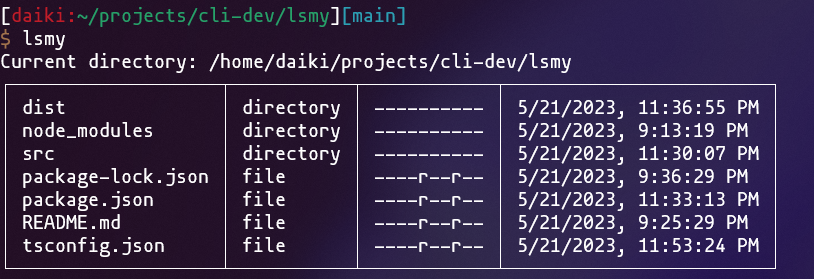
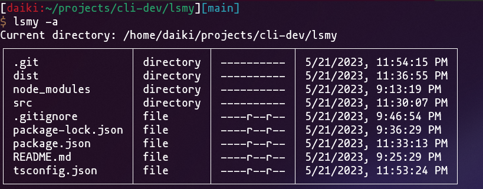

# lsmy is command line tool

The `ls` command is now a little easier to read.

# Introduction

When installed globally, it can be used anywhere.

```shell
$ npm install -g d-lsmy
```

# Screenshot

```shell
$ lsmy
```



Adding the `-a` option shows hidden files and folders.

```shell
$ lsmy -a
```



# Author

Daiki Nakashima